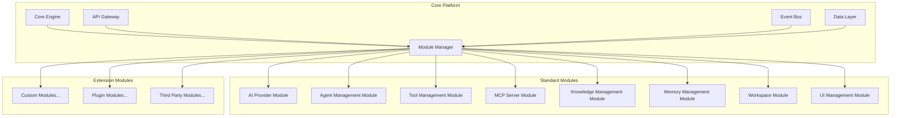

# AI Inference Platform - Technical Specification

## Executive Summary

Building a comprehensive, modular AI inference platform that serves as an extensible ChatGPT-like interface with unlimited customization and addon capabilities. The platform uses a standardized module architecture that makes adding new functionality seamless and maintainable.

## Core Vision

**"An infinitely extensible AI inference platform where every feature is a module"**

- Solid ChatGPT-like web interface foundation
- Modular architecture with standardized templates
- Easy provider/model management and filtering
- Advanced agent creation and management
- Workspace and knowledge persistence
- Plugin system for unlimited extensibility

## Modular Architecture Overview



## Module Template & Schema System

### Standard Module Schema

```typescript
interface ModuleDefinition {
  // Module Identity
  id: string;
  name: string;
  version: string;
  description: string;
  author: string;

  // Module Configuration
  type: 'core' | 'standard' | 'plugin' | 'extension';
  dependencies: string[];
  permissions: string[];

  // API Endpoints
  routes: RouteDefinition[];

  // Database Schema
  schema: {
    tables: TableDefinition[];
    migrations: MigrationDefinition[];
  };

  // Frontend Components
  ui: {
    components: ComponentDefinition[];
    routes: UIRouteDefinition[];
    styles: string[];
    scripts: string[];
  };

  // Event Handlers
  events: {
    listeners: EventListenerDefinition[];
    emitters: EventEmitterDefinition[];
  };

  // Configuration Schema
  config: ConfigSchemaDefinition;

  // Lifecycle Hooks
  hooks: {
    onInstall?: () => Promise<void>;
    onUninstall?: () => Promise<void>;
    onEnable?: () => Promise<void>;
    onDisable?: () => Promise<void>;
    onUpdate?: (oldVersion: string) => Promise<void>;
  };
}
```

### Module Template Structure

```
modules/
├── module-template/
│   ├── package.json           # Module metadata
│   ├── module.config.js       # Module configuration
│   ├── backend/
│   │   ├── routes/            # API endpoints
│   │   ├── models/            # Database models
│   │   ├── services/          # Business logic
│   │   ├── middleware/        # Custom middleware
│   │   └── index.js          # Module entry point
│   ├── frontend/
│   │   ├── components/        # UI components
│   │   ├── pages/            # Full page components
│   │   ├── styles/           # CSS/SCSS files
│   │   └── scripts/          # JavaScript modules
│   ├── database/
│   │   ├── schema.sql        # Database schema
│   │   └── migrations/       # Migration scripts
│   ├── tests/
│   │   ├── unit/             # Unit tests
│   │   ├── integration/      # Integration tests
│   │   └── e2e/              # End-to-end tests
│   └── docs/
│       ├── README.md         # Module documentation
│       ├── API.md           # API documentation
│       └── CHANGELOG.md     # Version history
```

## Core Platform Components

### 1. Core Engine

- Module lifecycle management
- Dependency resolution
- Event coordination
- Error handling and recovery
- Performance monitoring

### 2. Module Manager

- Module discovery and loading
- Dependency injection
- Configuration management
- Security and sandboxing
- Version compatibility

### 3. API Gateway

- Unified routing system
- Authentication and authorization
- Rate limiting and throttling
- Request/response transformation
- API versioning

### 4. Event Bus

- Inter-module communication
- Async event handling
- Event persistence and replay
- Message queuing
- Error handling

### 5. Data Layer

- Multi-database support (SQLite, PostgreSQL, etc.)
- Schema migration management
- Data validation and sanitization
- Backup and restore
- Query optimization

## Standard Modules Specification

### AI Provider Management Module

**Purpose**: Manage AI providers, their configurations, and model selection

**Features**:

- Add/modify/remove AI providers
- API key management with encryption
- Model discovery and filtering
- Global parameter configuration
- Provider health monitoring
- Cost tracking and limits

**Database Schema**:

```sql
-- Providers table
CREATE TABLE providers (
  id INTEGER PRIMARY KEY,
  name TEXT UNIQUE NOT NULL,
  type TEXT NOT NULL, -- 'openai', 'anthropic', 'ollama', etc.
  endpoint TEXT,
  api_key_encrypted TEXT,
  enabled BOOLEAN DEFAULT 1,
  config JSON,
  created_at TIMESTAMP DEFAULT CURRENT_TIMESTAMP,
  updated_at TIMESTAMP DEFAULT CURRENT_TIMESTAMP
);

-- Models table
CREATE TABLE provider_models (
  id INTEGER PRIMARY KEY,
  provider_id INTEGER REFERENCES providers(id),
  model_id TEXT NOT NULL,
  model_name TEXT NOT NULL,
  enabled BOOLEAN DEFAULT 1,
  parameters JSON,
  cost_per_token DECIMAL(10,6),
  context_window INTEGER,
  capabilities JSON,
  UNIQUE(provider_id, model_id)
);

-- Provider usage tracking
CREATE TABLE provider_usage (
  id INTEGER PRIMARY KEY,
  provider_id INTEGER REFERENCES providers(id),
  model_id TEXT,
  tokens_used INTEGER,
  cost DECIMAL(10,2),
  requests_count INTEGER,
  date DATE,
  UNIQUE(provider_id, model_id, date)
);
```

**API Endpoints**:

- `GET /api/providers` - List all providers
- `POST /api/providers` - Add new provider
- `PUT /api/providers/:id` - Update provider
- `DELETE /api/providers/:id` - Remove provider
- `GET /api/providers/:id/models` - List provider models
- `POST /api/providers/:id/models/refresh` - Refresh model list
- `PUT /api/providers/:id/models/:modelId/toggle` - Enable/disable model

### Agent Management Module

**Purpose**: Create, configure, and manage AI agents with complete customization

**Features**:

- Visual agent builder with real-time preview
- Full CRUD operations for agents
- System prompt editor with variables
- Tool and knowledge attachment
- Parameter optimization and testing
- Agent versioning and rollback
- Performance analytics

**Database Schema**:

```sql
-- Agents table
CREATE TABLE agents (
  id INTEGER PRIMARY KEY,
  name TEXT UNIQUE NOT NULL,
  description TEXT,
  provider_id INTEGER REFERENCES providers(id),
  model_id TEXT NOT NULL,
  system_prompt TEXT,
  parameters JSON,
  enabled BOOLEAN DEFAULT 1,
  version INTEGER DEFAULT 1,
  parent_id INTEGER REFERENCES agents(id), -- For versioning
  metadata JSON,
  created_at TIMESTAMP DEFAULT CURRENT_TIMESTAMP,
  updated_at TIMESTAMP DEFAULT CURRENT_TIMESTAMP
);

-- Agent tools relationship
CREATE TABLE agent_tools (
  id INTEGER PRIMARY KEY,
  agent_id INTEGER REFERENCES agents(id),
  tool_id INTEGER REFERENCES tools(id),
  config JSON,
  enabled BOOLEAN DEFAULT 1,
  UNIQUE(agent_id, tool_id)
);

-- Agent knowledge relationship
CREATE TABLE agent_knowledge (
  id INTEGER PRIMARY KEY,
  agent_id INTEGER REFERENCES agents(id),
  knowledge_id INTEGER REFERENCES knowledge_bases(id),
  priority INTEGER DEFAULT 1,
  enabled BOOLEAN DEFAULT 1,
  UNIQUE(agent_id, knowledge_id)
);

-- Agent usage analytics
CREATE TABLE agent_usage (
  id INTEGER PRIMARY KEY,
  agent_id INTEGER REFERENCES agents(id),
  session_id TEXT,
  tokens_used INTEGER,
  response_time INTEGER,
  user_rating INTEGER,
  timestamp TIMESTAMP DEFAULT CURRENT_TIMESTAMP
);
```

### Tool Management Module

**Purpose**: Manage external tools, APIs, and integrations that agents can use

**Features**:

- Tool discovery and registration
- API wrapper generation
- Input/output schema validation
- Permission and security management
- Tool testing and debugging
- Usage monitoring and rate limiting

**Database Schema**:

```sql
-- Tools table
CREATE TABLE tools (
  id INTEGER PRIMARY KEY,
  name TEXT UNIQUE NOT NULL,
  description TEXT,
  type TEXT NOT NULL, -- 'api', 'mcp', 'function', 'webhook'
  endpoint TEXT,
  method TEXT,
  headers JSON,
  input_schema JSON,
  output_schema JSON,
  auth_config JSON,
  rate_limit INTEGER,
  enabled BOOLEAN DEFAULT 1,
  created_at TIMESTAMP DEFAULT CURRENT_TIMESTAMP
);

-- Tool executions log
CREATE TABLE tool_executions (
  id INTEGER PRIMARY KEY,
  tool_id INTEGER REFERENCES tools(id),
  agent_id INTEGER REFERENCES agents(id),
  session_id TEXT,
  input_data JSON,
  output_data JSON,
  execution_time INTEGER,
  status TEXT, -- 'success', 'error', 'timeout'
  error_message TEXT,
  timestamp TIMESTAMP DEFAULT CURRENT_TIMESTAMP
);
```

### MCP Server Module

**Purpose**: Model Context Protocol server management and integration

**Features**:

- MCP server discovery and registration
- Tool and resource management
- Authentication and security
- Protocol version compatibility
- Health monitoring and alerting

### Knowledge Management Module

**Purpose**: Manage knowledge bases, documents, and context for agents

**Features**:

- Document upload and processing
- Vector embeddings and search
- Knowledge base versioning
- Access control and sharing
- Content summarization
- Knowledge graph visualization

**Database Schema**:

```sql
-- Knowledge bases
CREATE TABLE knowledge_bases (
  id INTEGER PRIMARY KEY,
  name TEXT UNIQUE NOT NULL,
  description TEXT,
  type TEXT, -- 'documents', 'qa', 'structured', 'vector'
  config JSON,
  embedding_model TEXT,
  created_at TIMESTAMP DEFAULT CURRENT_TIMESTAMP
);

-- Knowledge documents
CREATE TABLE knowledge_documents (
  id INTEGER PRIMARY KEY,
  knowledge_base_id INTEGER REFERENCES knowledge_bases(id),
  title TEXT NOT NULL,
  content TEXT,
  content_type TEXT,
  file_path TEXT,
  embeddings BLOB,
  metadata JSON,
  indexed_at TIMESTAMP,
  created_at TIMESTAMP DEFAULT CURRENT_TIMESTAMP
);

-- Knowledge queries log
CREATE TABLE knowledge_queries (
  id INTEGER PRIMARY KEY,
  knowledge_base_id INTEGER REFERENCES knowledge_bases(id),
  query TEXT,
  results JSON,
  relevance_scores JSON,
  timestamp TIMESTAMP DEFAULT CURRENT_TIMESTAMP
);
```

### Memory Management Module

**Purpose**: Handle conversation memory, context windows, and persistence

**Features**:

- Conversation history management
- Context window optimization
- Memory compression algorithms
- Long-term memory storage
- Memory search and retrieval
- Privacy and data retention policies

### Workspace Module

**Purpose**: Save, load, and manage complete working environments

**Features**:

- Workspace templates and presets
- Complete state serialization
- Import/export functionality
- Workspace sharing and collaboration
- Version control for workspaces
- Backup and restore

**Database Schema**:

```sql
-- Workspaces
CREATE TABLE workspaces (
  id INTEGER PRIMARY KEY,
  name TEXT UNIQUE NOT NULL,
  description TEXT,
  config JSON, -- Complete workspace state
  thumbnail TEXT, -- Base64 encoded screenshot
  is_default BOOLEAN DEFAULT 0,
  created_at TIMESTAMP DEFAULT CURRENT_TIMESTAMP,
  updated_at TIMESTAMP DEFAULT CURRENT_TIMESTAMP
);

-- Workspace sessions
CREATE TABLE workspace_sessions (
  id INTEGER PRIMARY KEY,
  workspace_id INTEGER REFERENCES workspaces(id),
  session_data JSON,
  active BOOLEAN DEFAULT 1,
  created_at TIMESTAMP DEFAULT CURRENT_TIMESTAMP
);
```

### UI Management Module

**Purpose**: Handle interface customization, themes, and layout management

**Features**:

- Drag-and-drop interface builder
- Component library and marketplace
- Theme creation and sharing
- Layout presets and saving
- Responsive design management
- Accessibility features

## Technical Implementation Stack

### Backend

- **Runtime**: Node.js 18+
- **Framework**: Express.js with TypeScript
- **Database**: SQLite (development) / PostgreSQL (production)
- **ORM**: Custom query builder with migration support
- **Authentication**: JWT with refresh tokens
- **Caching**: Redis for sessions and frequent queries
- **Queue**: Bull for background jobs
- **Testing**: Jest + Supertest
- **Documentation**: OpenAPI/Swagger

### Frontend

- **Base**: Vanilla JavaScript/TypeScript (for maximum compatibility)
- **Build Tool**: Vite with hot reload
- **Components**: Custom web components with lit-html
- **State Management**: Simple event-driven architecture
- **Styling**: CSS custom properties with SCSS
- **Icons**: Lucide or Phosphor icon set
- **Charts**: Chart.js for analytics
- **Editor**: Monaco Editor for code/prompt editing

### DevOps & Infrastructure

- **Containerization**: Docker with multi-stage builds
- **Reverse Proxy**: Nginx with rate limiting
- **Process Management**: PM2 for clustering
- **Monitoring**: Prometheus + Grafana
- **Logging**: Winston with structured logging
- **Security**: Helmet.js, rate limiting, input validation

## Module Development Workflow

### 1. Module Scaffolding

```bash
# Generate new module from template
npm run create-module --name="my-custom-module" --type="plugin"

# This creates the complete module structure with:
# - Boilerplate code and configuration
# - Example API endpoints and UI components
# - Test scaffolding
# - Documentation templates
```

### 2. Development Process

1. **Design**: Define module requirements and API
2. **Scaffold**: Generate module template
3. **Implement**: Build backend services and frontend components
4. **Test**: Unit, integration, and E2E testing
5. **Document**: API docs and user guides
6. **Package**: Create installable module package

### 3. Module Installation

```bash
# Install module from marketplace
npm run install-module --package="@platform/awesome-module"

# Install local development module
npm run install-module --path="./modules/my-module"

# Enable/disable modules
npm run module enable awesome-module
npm run module disable awesome-module
```

## Security & Performance Considerations

### Security

- Module sandboxing and permission system
- API key encryption and rotation
- Input validation and sanitization
- Rate limiting per module and user
- Audit logging for all operations
- Regular security scanning

### Performance

- Lazy loading of modules and components
- Database query optimization
- Caching strategies at multiple levels
- Background processing for heavy operations
- Resource monitoring and alerting
- Horizontal scaling support

## Development Phases & Priorities

### Phase 1: Foundation (Core Platform)

- **Priority**: Critical
- **Scope**: Core engine, module manager, basic API gateway
- **Deliverables**: Working module system with template

### Phase 2: Essential Modules

- **Priority**: High
- **Scope**: AI Provider, Agent Management, basic UI modules
- **Deliverables**: Functional chat interface with agent switching

### Phase 3: Advanced Features

- **Priority**: Medium-High
- **Scope**: Tool Management, Knowledge, Memory modules
- **Deliverables**: Full-featured agent capabilities

### Phase 4: Workspace & Customization

- **Priority**: Medium
- **Scope**: Workspace, UI Management modules
- **Deliverables**: Complete customization capabilities

### Phase 5: Extension Ecosystem

- **Priority**: Low-Medium
- **Scope**: Plugin marketplace, developer tools
- **Deliverables**: Third-party module support

## Success Metrics

### Technical Metrics

- Module load time < 100ms
- API response time < 200ms
- 99.9% uptime
- Zero-downtime module updates
- Comprehensive test coverage > 90%

### User Experience Metrics

- Agent creation time < 5 minutes
- Workspace load time < 2 seconds
- Module installation success rate > 98%
- User satisfaction score > 4.5/5

### Platform Metrics

- Number of active modules
- Module marketplace engagement
- Developer adoption rate
- Community contributions

## Conclusion

This modular architecture creates a truly extensible AI inference platform where every feature is a self-contained module. The standardized template system ensures consistency while allowing unlimited customization and functionality expansion. The platform can grow from a simple ChatGPT-like interface to a comprehensive AI development and deployment environment.

The module-first approach means:

- **Easy Development**: Standardized templates and tooling
- **Clean Architecture**: Clear separation of concerns
- **Infinite Extensibility**: No limits on functionality
- **Community Growth**: Easy for others to contribute
- **Future Proof**: New AI providers and tools can be added seamlessly

This creates the foundation for not just an AI chat interface, but a complete AI development platform that can evolve with the rapidly changing AI landscape.
