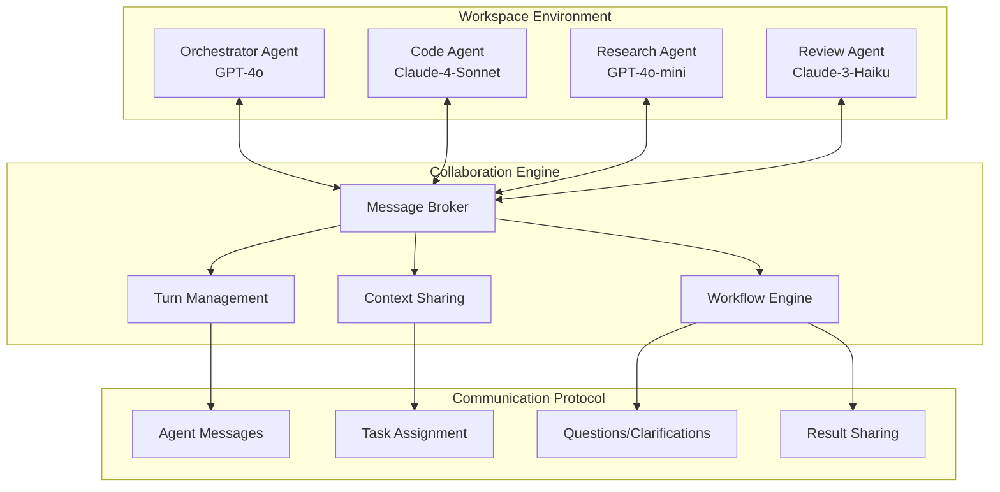

# AI Inference Platform - Technical Specification v2

## Executive Summary

Building a comprehensive, modular AI inference platform with **multi-agent collaboration capabilities** and infinite extensibility. The platform enables different AI models to work together in the same workspace, communicating and collaborating on complex tasks while maintaining a clean, modular architecture.

## Updated Core Vision

**"An infinitely extensible AI inference platform where agents collaborate seamlessly"**

- Solid ChatGPT-like web interface foundation
- **Multi-agent workspace collaboration** - agents can communicate with each other
- Modular architecture with standardized templates
- Code reuse and migration from existing prototype
- Easy provider/model management and filtering
- Advanced agent creation and management
- Workspace and knowledge persistence

## Multi-Agent Collaboration Architecture



## Enhanced Module System with Collaboration

### Multi-Agent Collaboration Module

**Purpose**: Enable seamless communication and collaboration between multiple agents in a workspace

**Key Features**:

- **Agent-to-Agent Messaging**: Direct communication protocol between agents
- **Role-Based Orchestration**: Define agent roles (orchestrator, specialist, reviewer, etc.)
- **Turn Management**: Intelligent turn-taking and conversation flow
- **Context Sharing**: Shared workspace context and memory
- **Task Delegation**: Agents can assign tasks to other agents
- **Collaborative Workflows**: Pre-defined multi-agent workflows

**Database Schema**:

```sql
-- Agent conversations within workspaces
CREATE TABLE agent_conversations (
  id INTEGER PRIMARY KEY,
  workspace_id INTEGER REFERENCES workspaces(id),
  conversation_id TEXT UNIQUE NOT NULL,
  participants JSON, -- Array of agent IDs
  orchestrator_id INTEGER REFERENCES agents(id),
  status TEXT DEFAULT 'active', -- 'active', 'paused', 'completed'
  created_at TIMESTAMP DEFAULT CURRENT_TIMESTAMP
);

-- Individual messages between agents
CREATE TABLE agent_messages (
  id INTEGER PRIMARY KEY,
  conversation_id TEXT REFERENCES agent_conversations(conversation_id),
  from_agent_id INTEGER REFERENCES agents(id),
  to_agent_id INTEGER REFERENCES agents(id), -- NULL for broadcast
  message_type TEXT, -- 'task', 'question', 'result', 'clarification'
  content JSON,
  parent_message_id INTEGER REFERENCES agent_messages(id),
  timestamp TIMESTAMP DEFAULT CURRENT_TIMESTAMP
);

-- Task assignments between agents
CREATE TABLE agent_tasks (
  id INTEGER PRIMARY KEY,
  conversation_id TEXT REFERENCES agent_conversations(conversation_id),
  assigner_id INTEGER REFERENCES agents(id),
  assignee_id INTEGER REFERENCES agents(id),
  task_description TEXT,
  task_data JSON,
  status TEXT DEFAULT 'pending', -- 'pending', 'in_progress', 'completed', 'failed'
  result JSON,
  created_at TIMESTAMP DEFAULT CURRENT_TIMESTAMP,
  completed_at TIMESTAMP
);

-- Shared workspace context
CREATE TABLE workspace_context (
  id INTEGER PRIMARY KEY,
  workspace_id INTEGER REFERENCES workspaces(id),
  context_type TEXT, -- 'shared_memory', 'files', 'variables', 'state'
  context_key TEXT,
  context_value JSON,
  created_by_agent INTEGER REFERENCES agents(id),
  updated_at TIMESTAMP DEFAULT CURRENT_TIMESTAMP,
  UNIQUE(workspace_id, context_type, context_key)
);
```

**Agent Communication Protocol**:

```typescript
interface AgentMessage {
  id: string;
  conversationId: string;
  fromAgent: string;
  toAgent?: string; // null for broadcast
  messageType: 'task' | 'question' | 'result' | 'clarification' | 'status';
  content: {
    text: string;
    data?: any;
    taskId?: string;
    priority?: 'low' | 'medium' | 'high' | 'urgent';
  };
  parentMessageId?: string;
  timestamp: string;
}

interface TaskAssignment {
  id: string;
  description: string;
  data: any;
  requirements: string[];
  expectedOutput: string;
  deadline?: string;
  priority: 'low' | 'medium' | 'high' | 'urgent';
}
```

**API Endpoints**:

- `POST /api/workspaces/:id/conversations` - Start agent conversation
- `POST /api/conversations/:id/messages` - Send agent message
- `GET /api/conversations/:id/messages` - Get conversation history
- `POST /api/conversations/:id/tasks` - Assign task to agent
- `PUT /api/tasks/:id/status` - Update task status
- `GET /api/workspaces/:id/context` - Get shared context
- `PUT /api/workspaces/:id/context` - Update shared context

## Code Audit and Reuse Strategy

### Current Codebase Analysis

**✅ KEEP & ENHANCE** (Working Foundation):

```
providers/
├── openai.js          ✅ Solid implementation - enhance for agent integration
├── anthropic.js       ✅ Good foundation - add agent messaging support
├── ollama.js          ✅ Working - add collaboration features
├── openrouter.js      ✅ Functional - enhance for multi-agent
└── mcp.js            ✅ MCP foundation exists - integrate with agent system

database.js            ✅ Good schema foundation - extend for collaboration
routes/
├── chat.js           ✅ Core chat working - enhance for agent-to-agent
├── agents.js         ✅ Basic agent CRUD - expand significantly
├── models.js         ✅ Model management - enhance filtering
├── settings.js       ✅ Provider settings - keep and extend
└── mcp.js           ✅ MCP integration - enhance for agent tools

public/
├── css/styles.css    ✅ Good foundation - enhance for multi-agent UI
├── js/chat.js        ✅ Core chat UI - modify for agent conversations
├── js/agent-manager.js ✅ Basic agent management - expand significantly
└── js/settings-modal.js ✅ Settings UI - enhance for workspace config

utils/
├── helpers.js        ✅ Utility functions - extend for agent operations
└── security.js      ✅ Security functions - enhance for multi-agent auth
```

**🔄 MODIFY & EXTEND** (Needs Significant Changes):

```
index.js              🔄 Main server - refactor for modular architecture
index-old.js          🔄 Has working multi-provider - extract good parts
public/index.html     🔄 Basic UI - redesign for multi-agent workspace
public/js/main.js     🔄 App initialization - restructure for modules
```

**❌ DELETE** (Cleanup Targets):

```
index-new.js          ❌ Incomplete/broken version
index-minimal*.js     ❌ Test files not needed for production
index-clean.js        ❌ Another iteration - consolidate
index-direct.js       ❌ Alternative approach - not using
test-*.js            ❌ Move to proper tests/ directory or delete
minimal-server.js     ❌ Development artifact
run-tests.js         ❌ Replace with proper npm test
```

### Migration Strategy

#### Phase 1: Consolidation & Foundation

1. **Main Server Consolidation**
   - Extract working parts from `index-old.js`
   - Merge with current `index.js`
   - Create clean, modular entry point
   - Delete all alternative index files

2. **Provider Enhancement**
   - Extend existing provider files for agent messaging
   - Add agent context injection
   - Implement provider-level load balancing

3. **Database Migration**
   - Extend current schema with collaboration tables
   - Migrate existing agent data
   - Add proper indexes and constraints

#### Phase 2: Agent Collaboration Core

1. **Enhanced Agent Management**
   - Expand `routes/agents.js` with collaboration features
   - Add role definitions and permissions
   - Implement agent discovery and registration

2. **Collaboration Engine**
   - Build message broker for agent communication
   - Implement turn management system
   - Create shared context management

3. **Workspace System**
   - Multi-agent workspace creation
   - Agent assignment and role management
   - Workflow definition and execution

#### Phase 3: UI Transformation

1. **Multi-Agent Interface**
   - Redesign chat interface for multiple agents
   - Add agent status and activity indicators
   - Implement drag-drop agent assignment

2. **Workspace Management**
   - Visual workspace builder
   - Agent conversation views
   - Task tracking and monitoring

## Updated Module Specifications

### 1. AI Provider Management Module (Enhanced)

**Modifications to Existing**:

- Extend current provider system with agent-specific configurations
- Add load balancing for multi-agent scenarios
- Implement provider failover for agent continuity

### 2. Agent Management Module (Major Enhancement)

**Building on Existing**:

- Expand current basic agent CRUD to full collaboration system
- Add role definitions (orchestrator, specialist, reviewer, etc.)
- Implement agent discovery and auto-assignment
- Add performance analytics and optimization

### 3. Workspace Collaboration Module (New)

**Purpose**: Manage multi-agent workspaces and orchestrate collaboration

**Features**:

- Workspace templates for common multi-agent scenarios
- Real-time agent activity monitoring
- Collaborative workflow designer
- Conflict resolution for competing agent actions

### 4. Communication Protocol Module (New)

**Purpose**: Handle all agent-to-agent communication and messaging

**Features**:

- Message routing and delivery
- Priority queuing for urgent tasks
- Message persistence and replay
- Communication analytics and optimization

## Enhanced Technical Stack

### Backend (Building on Existing)

- **Runtime**: Node.js 18+ (current)
- **Framework**: Express.js (current) + WebSocket for real-time agent communication
- **Database**: SQLite (current) with enhanced schema for collaboration
- **Message Queue**: Add Redis for agent message broking
- **Real-time**: Socket.io for live agent status and messaging

### Frontend (Enhancing Existing)

- **Base**: Current vanilla JS structure, enhanced for multi-agent
- **Real-time Updates**: WebSocket integration for live agent communication
- **Agent UI**: Enhanced current agent manager for collaboration features
- **Workspace Views**: New multi-agent workspace interface

## Implementation Phases (Realistic Timeline)

### Phase 1: Foundation Cleanup & Enhancement (1-2 weeks)

- Consolidate index files and clean up codebase
- Enhance existing provider implementations
- Extend database schema for collaboration
- Basic agent-to-agent messaging framework

### Phase 2: Core Collaboration Features (2-3 weeks)

- Implement message broker and turn management
- Build workspace system with multi-agent support
- Create agent communication protocol
- Enhanced agent management with roles

### Phase 3: Advanced Collaboration (2-3 weeks)

- Workflow engine for complex multi-agent tasks
- Shared context and memory management
- Conflict resolution and error handling
- Performance optimization

### Phase 4: UI/UX Enhancement (1-2 weeks)

- Multi-agent workspace interface
- Real-time agent activity monitoring
- Enhanced chat interface for agent conversations
- Workspace management and configuration

### Phase 5: Polish & Extensions (1-2 weeks)

- Advanced workflow templates
- Analytics and monitoring
- Documentation and examples
- Performance tuning

## Success Criteria

### Technical Metrics

- Agent-to-agent message latency < 100ms
- Workspace load time < 2 seconds
- Support for 10+ simultaneous agents per workspace
- 99.9% message delivery reliability

### User Experience

- Intuitive multi-agent workspace creation
- Seamless agent collaboration flows
- Clear visibility into agent activities and status
- Easy workspace sharing and templates

### Collaboration Examples

**Example 1: Code Development Workflow**

1. User asks: "Build a REST API for user management"
2. **Orchestrator (GPT-4o)**: Analyzes request, creates development plan
3. **Orchestrator → Code Agent (Claude-4-Sonnet)**: "Create user model and CRUD endpoints"
4. **Code Agent**: Implements code, asks clarification about authentication
5. **Orchestrator**: Provides authentication requirements
6. **Code Agent → Review Agent**: "Please review this user management API"
7. **Review Agent**: Reviews code, suggests improvements
8. **Code Agent**: Implements suggestions, delivers final result

**Example 2: Research & Analysis**

1. User: "Analyze market trends for AI startups in 2024"
2. **Orchestrator**: Breaks down into research tasks
3. **Research Agent 1**: Gathers funding data
4. **Research Agent 2**: Collects market size data
5. **Analysis Agent**: Combines data and creates insights
6. **Writing Agent**: Creates final comprehensive report

This enhanced specification maintains the modular architecture while adding the critical multi-agent collaboration capabilities and a clear strategy for reusing and enhancing the existing codebase.
