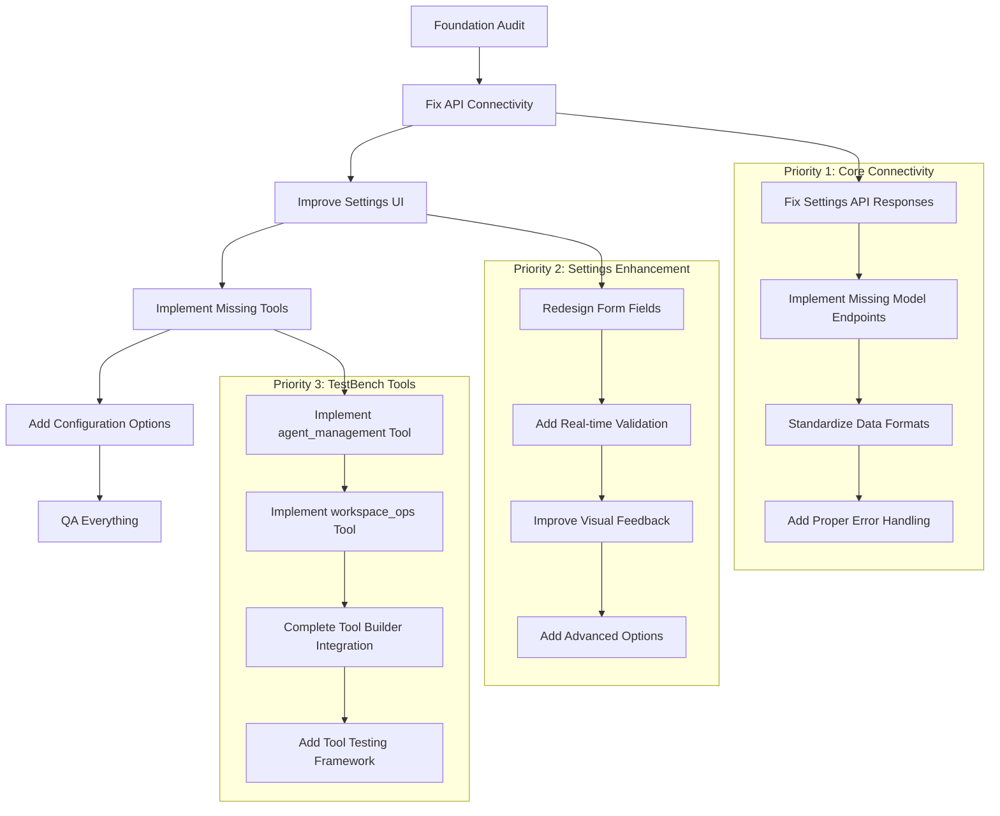

# Testbench AI Platform - Foundation Fix Plan

## Executive Summary

This plan addresses critical foundation issues in the Testbench AI platform before implementing advanced features. The focus is on fixing core API connectivity, improving the settings interface, and implementing missing TestBench agent tools to ensure the platform works reliably.

## Critical Issues Identified

### 1. Frontend-Backend API Mismatch

- **Settings API**: Frontend expects settings directly, but backend returns `{ settings: allSettings }`
- **Missing Model Endpoints**: Frontend calls endpoints that may not exist or have incorrect implementations
- **Data Format Inconsistencies**: Response formats don't match frontend expectations
- **Error Handling**: Poor error propagation between frontend and backend

### 2. TestBench Agent Missing Tools

- **agent_management** tool: Referenced in config but not implemented
- **workspace_ops** tool: Referenced in config but not implemented
- **Tool Builder Integration**: Partial implementation, needs completion

### 3. Settings UI/UX Issues

- **Poor Field Design**: Basic HTML inputs without proper styling/validation
- **Limited Configurability**: Missing advanced settings options
- **No Real-time Validation**: API keys tested manually only
- **Poor Error Handling**: Generic error messages with no actionable guidance

## Implementation Phases



## Phase 1: Fix API Connectivity (CRITICAL PRIORITY)

### 1.1 Settings API Response Fix

**Current Issue**:

- Frontend `AIServicesManager.loadProviderSettings()` expects settings directly
- Backend `/api/settings/list/all` returns `{ settings: allSettings }`
- This causes frontend to fail silently

**Required Changes**:

**File: `routes/settings.js`**

```javascript
// Fix line 57-67 response format
router.get('/api/settings/list/all', async (req, res) => {
    try {
        const providers = ['openai', 'anthropic', 'openrouter', 'ollama'];
        const allSettings = {};

        for (const provider of providers) {
            allSettings[provider] = database.getProviderSettings(provider);
        }

        // FIXED: Return settings directly, not wrapped
        res.json(allSettings);
    } catch (error) {
        console.error('Error getting all settings:', error.message);
        res.status(500).json({ error: error.message });
    }
});
```

**File: `public/js/ai-services.js`**

```javascript
// Update line 9-23 to handle correct response format
static async loadProviderSettings() {
    try {
        const response = await fetch('/api/settings/list/all');
        if (response.ok) {
            const settings = await response.json(); // Now expects settings directly
            this.populateProviderSettings(settings);
            await this.loadAllModels();
            await this.testAllConnections();
        } else {
            console.warn('Settings endpoint not available, using empty settings');
            await this.loadAllModels();
        }
    } catch (error) {
        console.error('Error loading provider settings:', error);
        await this.loadAllModels();
    }
}
```

### 1.2 Implement Missing Model Endpoints

**Required New Endpoints**:

**File: `routes/models.js` (CREATE IF MISSING)**

```javascript
const express = require('express');
const router = express.Router();
const database = require('../database');

// Test provider connection
router.post('/api/models/test-connection/:provider', async (req, res) => {
    const { provider } = req.params;
    const { config } = req.body;

    try {
        // Implementation depends on provider
        const providerConfig = config[provider] || {};
        const result = await testProviderConnection(provider, providerConfig);

        res.json({
            connected: result.success,
            message: result.message,
            modelCount: result.modelCount || 0,
            latency: result.latency || null
        });
    } catch (error) {
        res.json({
            connected: false,
            error: error.message,
            message: `Connection failed: ${error.message}`
        });
    }
});

// List models for provider
router.get('/api/models/list/:provider', async (req, res) => {
    const { provider } = req.params;

    try {
        const models = await getProviderModels(provider);
        res.json({ models });
    } catch (error) {
        res.status(500).json({ error: error.message, models: [] });
    }
});

// Refresh models
router.post('/api/models/action/refresh', async (req, res) => {
    const { provider, config } = req.body;

    try {
        let results = {};

        if (provider) {
            // Single provider refresh
            const refreshResult = await refreshProviderModels(provider, config[provider]);
            results[provider] = refreshResult;
        } else {
            // All providers refresh
            const providers = ['openai', 'anthropic', 'openrouter', 'ollama'];
            for (const p of providers) {
                try {
                    results[p] = await refreshProviderModels(p, config[p]);
                } catch (err) {
                    results[p] = { success: false, error: err.message };
                }
            }
        }

        res.json({ results });
    } catch (error) {
        res.status(500).json({ error: error.message });
    }
});

// Toggle model enabled/disabled
router.post('/api/models/action/toggle', async (req, res) => {
    const { provider, modelId, enabled } = req.body;

    try {
        database.setModelEnabled(provider, modelId, enabled);
        res.json({ success: true, provider, modelId, enabled });
    } catch (error) {
        res.status(500).json({ error: error.message });
    }
});

module.exports = router;
```

### 1.3 Standardize Data Formats

**Create Standard Response Format**:

**File: `utils/responseHelpers.js` (NEW)**

```javascript
class ResponseHelpers {
    static success(data, message = null) {
        return {
            success: true,
            data,
            message,
            timestamp: new Date().toISOString()
        };
    }

    static error(error, statusCode = 500, details = null) {
        return {
            success: false,
            error: typeof error === 'string' ? error : error.message,
            statusCode,
            details,
            timestamp: new Date().toISOString()
        };
    }

    static pagination(data, page, limit, total) {
        return {
            success: true,
            data,
            pagination: {
                page,
                limit,
                total,
                pages: Math.ceil(total / limit)
            },
            timestamp: new Date().toISOString()
        };
    }
}

module.exports = ResponseHelpers;
```

### 1.4 Add Proper Error Handling

**Frontend Error Handler Enhancement**:

**File: `public/js/utils.js`** (Update existing or create)

```javascript
class Utils {
    static async apiCall(url, options = {}) {
        try {
            const response = await fetch(url, {
                headers: {
                    'Content-Type': 'application/json',
                    ...options.headers
                },
                ...options
            });

            const data = await response.json();

            if (!response.ok) {
                throw new Error(data.error || `HTTP ${response.status}: ${response.statusText}`);
            }

            return data;
        } catch (error) {
            console.error(`API call failed for ${url}:`, error);
            throw error;
        }
    }

    static showError(message, details = null) {
        // Enhanced error display with details
        const errorDiv = document.createElement('div');
        errorDiv.className = 'error-notification';
        errorDiv.innerHTML = `
            <div class="error-header">${message}</div>
            ${details ? `<div class="error-details">${details}</div>` : ''}
            <button class="error-dismiss" onclick="this.parentElement.remove()">×</button>
        `;
        document.body.appendChild(errorDiv);

        // Auto-dismiss after 5 seconds
        setTimeout(() => errorDiv.remove(), 5000);
    }

    static showSuccess(message) {
        const successDiv = document.createElement('div');
        successDiv.className = 'success-notification';
        successDiv.innerHTML = `
            <div class="success-message">${message}</div>
            <button class="success-dismiss" onclick="this.parentElement.remove()">×</button>
        `;
        document.body.appendChild(successDiv);

        setTimeout(() => successDiv.remove(), 3000);
    }
}
```

## Phase 2: Settings UI Enhancement

### 2.1 Redesign Form Fields

**Enhanced Input Components**:

**File: `public/css/enhanced-forms.css` (NEW)**

```css
.enhanced-input-group {
    position: relative;
    margin-bottom: 1.5rem;
}

.enhanced-input {
    width: 100%;
    padding: 12px 16px;
    border: 2px solid var(--border-color);
    border-radius: 8px;
    font-size: 14px;
    transition: all 0.3s ease;
    background: var(--input-bg);
    color: var(--text-color);
}

.enhanced-input:focus {
    outline: none;
    border-color: var(--primary-color);
    box-shadow: 0 0 0 3px var(--primary-color-alpha);
}

.enhanced-input.error {
    border-color: var(--error-color);
}

.enhanced-input.success {
    border-color: var(--success-color);
}

.input-status-indicator {
    position: absolute;
    right: 12px;
    top: 50%;
    transform: translateY(-50%);
    font-size: 16px;
}

.password-toggle {
    position: absolute;
    right: 40px;
    top: 50%;
    transform: translateY(-50%);
    cursor: pointer;
    color: var(--text-muted);
}

.input-validation-message {
    margin-top: 4px;
    font-size: 12px;
    min-height: 16px;
}

.input-validation-message.error {
    color: var(--error-color);
}

.input-validation-message.success {
    color: var(--success-color);
}

.connection-status-indicator {
    display: inline-flex;
    align-items: center;
    gap: 8px;
    padding: 4px 8px;
    border-radius: 4px;
    font-size: 12px;
    font-weight: 500;
}

.status-connected {
    background: var(--success-bg);
    color: var(--success-color);
}

.status-disconnected {
    background: var(--error-bg);
    color: var(--error-color);
}

.status-testing {
    background: var(--warning-bg);
    color: var(--warning-color);
}
```

**Enhanced Settings Form Component**:

**File: `public/js/enhanced-settings-forms.js` (NEW)**

```javascript
class EnhancedSettingsForm {
    constructor(containerId) {
        this.container = document.getElementById(containerId);
        this.validators = new Map();
        this.realTimeValidation = true;
    }

    createEnhancedInput(config) {
        const {
            id,
            type = 'text',
            placeholder = '',
            label,
            required = false,
            validator = null,
            showPasswordToggle = false
        } = config;

        const groupDiv = document.createElement('div');
        groupDiv.className = 'enhanced-input-group';

        const labelEl = document.createElement('label');
        labelEl.setAttribute('for', id);
        labelEl.textContent = label + (required ? ' *' : '');
        labelEl.className = 'enhanced-label';

        const inputEl = document.createElement('input');
        inputEl.type = type;
        inputEl.id = id;
        inputEl.placeholder = placeholder;
        inputEl.className = 'enhanced-input';
        inputEl.required = required;

        if (showPasswordToggle && type === 'password') {
            const toggleEl = document.createElement('span');
            toggleEl.className = 'password-toggle';
            toggleEl.innerHTML = '👁️';
            toggleEl.onclick = () => this.togglePasswordVisibility(inputEl, toggleEl);
            groupDiv.appendChild(toggleEl);
        }

        const statusEl = document.createElement('div');
        statusEl.className = 'input-status-indicator';

        const messageEl = document.createElement('div');
        messageEl.className = 'input-validation-message';

        if (validator) {
            this.validators.set(id, validator);
            if (this.realTimeValidation) {
                inputEl.addEventListener('input', () => this.validateField(id));
                inputEl.addEventListener('blur', () => this.validateField(id));
            }
        }

        groupDiv.appendChild(labelEl);
        groupDiv.appendChild(inputEl);
        groupDiv.appendChild(statusEl);
        groupDiv.appendChild(messageEl);

        return groupDiv;
    }

    async validateField(fieldId) {
        const validator = this.validators.get(fieldId);
        if (!validator) return true;

        const inputEl = document.getElementById(fieldId);
        const statusEl = inputEl.parentElement.querySelector('.input-status-indicator');
        const messageEl = inputEl.parentElement.querySelector('.input-validation-message');

        try {
            const result = await validator(inputEl.value);

            if (result.valid) {
                inputEl.className = 'enhanced-input success';
                statusEl.innerHTML = '✅';
                messageEl.textContent = result.message || '';
                messageEl.className = 'input-validation-message success';
            } else {
                inputEl.className = 'enhanced-input error';
                statusEl.innerHTML = '❌';
                messageEl.textContent = result.message || 'Invalid input';
                messageEl.className = 'input-validation-message error';
            }

            return result.valid;
        } catch (error) {
            inputEl.className = 'enhanced-input error';
            statusEl.innerHTML = '❌';
            messageEl.textContent = 'Validation error';
            messageEl.className = 'input-validation-message error';
            return false;
        }
    }

    togglePasswordVisibility(inputEl, toggleEl) {
        if (inputEl.type === 'password') {
            inputEl.type = 'text';
            toggleEl.innerHTML = '🙈';
        } else {
            inputEl.type = 'password';
            toggleEl.innerHTML = '👁️';
        }
    }
}
```

### 2.2 Real-time Validation & Testing

**API Key Validators**:

**File: `public/js/validators.js` (NEW)**

```javascript
class Validators {
    static async validateOpenAIKey(apiKey) {
        if (!apiKey) return { valid: false, message: 'API key is required' };

        if (!apiKey.startsWith('sk-')) {
            return { valid: false, message: 'OpenAI API keys should start with "sk-"' };
        }

        if (apiKey.length < 40) {
            return { valid: false, message: 'API key appears too short' };
        }

        // Test the key with a simple API call
        try {
            const response = await fetch('/api/models/test-connection/openai', {
                method: 'POST',
                headers: { 'Content-Type': 'application/json' },
                body: JSON.stringify({ config: { openai: { key: apiKey } } })
            });

            const result = await response.json();

            if (result.connected) {
                return {
                    valid: true,
                    message: `✅ Connected (${result.modelCount} models available)`
                };
            } else {
                return {
                    valid: false,
                    message: `❌ Connection failed: ${result.message}`
                };
            }
        } catch (error) {
            return { valid: false, message: `❌ Test failed: ${error.message}` };
        }
    }

    static async validateAnthropicKey(apiKey) {
        if (!apiKey) return { valid: false, message: 'API key is required' };

        if (!apiKey.startsWith('sk-ant-')) {
            return { valid: false, message: 'Anthropic API keys should start with "sk-ant-"' };
        }

        // Test the key
        try {
            const response = await fetch('/api/models/test-connection/anthropic', {
                method: 'POST',
                headers: { 'Content-Type': 'application/json' },
                body: JSON.stringify({ config: { anthropic: { key: apiKey } } })
            });

            const result = await response.json();

            if (result.connected) {
                return { valid: true, message: `✅ Connected` };
            } else {
                return { valid: false, message: `❌ ${result.message}` };
            }
        } catch (error) {
            return { valid: false, message: `❌ Test failed: ${error.message}` };
        }
    }

    static validateURL(url) {
        if (!url) return { valid: false, message: 'URL is required' };

        try {
            new URL(url);
            return { valid: true, message: '✅ Valid URL format' };
        } catch {
            return { valid: false, message: '❌ Invalid URL format' };
        }
    }
}
```

### 2.3 Advanced Configuration Options

**Provider-Specific Settings**:

**File: `public/js/provider-advanced-settings.js` (NEW)**

```javascript
class ProviderAdvancedSettings {
    static createOpenAIAdvancedSettings() {
        return `
            <div class="advanced-settings-section">
                <h5>Advanced OpenAI Settings</h5>

                <div class="enhanced-input-group">
                    <label for="openai-org-id">Organization ID (optional)</label>
                    <input type="text" id="openai-org-id" class="enhanced-input"
                           placeholder="org-...">
                    <div class="input-help">Used for organization-specific billing and access</div>
                </div>

                <div class="enhanced-input-group">
                    <label for="openai-timeout">Request Timeout (seconds)</label>
                    <input type="number" id="openai-timeout" class="enhanced-input"
                           value="30" min="5" max="300">
                </div>

                <div class="enhanced-input-group">
                    <label for="openai-retry-attempts">Retry Attempts</label>
                    <input type="number" id="openai-retry-attempts" class="enhanced-input"
                           value="3" min="0" max="10">
                </div>

                <div class="enhanced-input-group">
                    <label for="openai-rate-limit">Rate Limit (requests/minute)</label>
                    <input type="number" id="openai-rate-limit" class="enhanced-input"
                           value="60" min="1" max="1000">
                </div>

                <div class="settings-group">
                    <label>
                        <input type="checkbox" id="openai-stream-responses" checked>
                        Enable streaming responses
                    </label>
                </div>

                <div class="settings-group">
                    <label>
                        <input type="checkbox" id="openai-function-calling">
                        Enable function calling
                    </label>
                </div>
            </div>
        `;
    }

    static createAnthropicAdvancedSettings() {
        return `
            <div class="advanced-settings-section">
                <h5>Advanced Anthropic Settings</h5>

                <div class="enhanced-input-group">
                    <label for="anthropic-timeout">Request Timeout (seconds)</label>
                    <input type="number" id="anthropic-timeout" class="enhanced-input"
                           value="30" min="5" max="300">
                </div>

                <div class="enhanced-input-group">
                    <label for="anthropic-max-tokens">Default Max Tokens</label>
                    <input type="number" id="anthropic-max-tokens" class="enhanced-input"
                           value="4000" min="1" max="100000">
                </div>

                <div class="settings-group">
                    <label>
                        <input type="checkbox" id="anthropic-safety-mode" checked>
                        Enable enhanced safety mode
                    </label>
                </div>
            </div>
        `;
    }

    static createOllamaAdvancedSettings() {
        return `
            <div class="advanced-settings-section">
                <h5>Advanced Ollama Settings</h5>

                <div class="enhanced-input-group">
                    <label for="ollama-gpu-layers">GPU Layers</label>
                    <input type="number" id="ollama-gpu-layers" class="enhanced-input"
                           value="0" min="0" max="100">
                    <div class="input-help">Number of layers to run on GPU (0 = auto)</div>
                </div>

                <div class="enhanced-input-group">
                    <label for="ollama-context-size">Context Size</label>
                    <input type="number" id="ollama-context-size" class="enhanced-input"
                           value="2048" min="512" max="32768">
                </div>

                <div class="enhanced-input-group">
                    <label for="ollama-num-predict">Max Prediction Length</label>
                    <input type="number" id="ollama-num-predict" class="enhanced-input"
                           value="128" min="1" max="2048">
                </div>

                <div class="settings-group">
                    <label>
                        <input type="checkbox" id="ollama-auto-pull">
                        Auto-pull missing models
                    </label>
                </div>
            </div>
        `;
    }
}
```

## Phase 3: TestBench Agent Tools Implementation

### 3.1 Implement agent_management Tool

**File: `routes/tools.js` (UPDATE EXISTING OR CREATE)**

```javascript
// Add to existing tools router

// Agent Management Tool Implementation
router.post('/api/tools/agent_management', async (req, res) => {
    const { action, agentId, config, filters } = req.body;

    try {
        let result;

        switch (action) {
            case 'create':
                if (!config || !config.name || !config.model) {
                    return res.status(400).json({
                        error: 'Agent config with name and model is required'
                    });
                }

                const newAgent = {
                    name: config.name,
                    provider: config.provider || 'openai',
                    model: config.model,
                    settings: {
                        systemMessage: config.systemMessage || 'You are a helpful assistant.',
                        temperature: config.temperature || 0.7,
                        maxTokens: config.maxTokens || 4000,
                        ...config.settings
                    },
                    role: config.role || 'assistant',
                    capabilities: config.capabilities || ['messaging'],
                    enabled: config.enabled !== false
                };

                const createResult = database.saveAgentEnhanced(newAgent);
                result = {
                    success: true,
                    agentId: createResult.lastInsertRowid,
                    agent: { ...newAgent, id: createResult.lastInsertRowid }
                };
                break;

            case 'update':
                if (!agentId) {
                    return res.status(400).json({ error: 'Agent ID is required for update' });
                }

                const existingAgent = database.getAgentEnhanced(agentId);
                if (!existingAgent) {
                    return res.status(404).json({ error: 'Agent not found' });
                }

                const updatedAgent = { ...existingAgent, ...config, id: agentId };
                database.saveAgentEnhanced(updatedAgent);

                result = {
                    success: true,
                    agentId,
                    agent: updatedAgent
                };
                break;

            case 'delete':
                if (!agentId) {
                    return res.status(400).json({ error: 'Agent ID is required for delete' });
                }

                database.deleteAgent(agentId);
                result = {
                    success: true,
                    agentId,
                    message: 'Agent deleted successfully'
                };
                break;

            case 'list':
                const agents = database.listAgentsEnhanced(filters);
                result = {
                    success: true,
                    agents,
                    count: agents.length
                };
                break;

            case 'test':
                if (!agentId) {
                    return res.status(400).json({ error: 'Agent ID is required for test' });
                }

                const testAgent = database.getAgentEnhanced(agentId);
                if (!testAgent) {
                    return res.status(404).json({ error: 'Agent not found' });
                }

                // Test agent with a simple prompt
                const testPrompt = config.testPrompt || 'Hello, please introduce yourself briefly.';
                const testResult = await testAgentResponse(testAgent, testPrompt);

                result = {
                    success: testResult.success,
                    agentId,
                    testPrompt,
                    response: testResult.response,
                    latency: testResult.latency,
                    error: testResult.error
                };
                break;

            default:
                return res.status(400).json({ error: `Unknown action: ${action}` });
        }

        res.json(result);

    } catch (error) {
        console.error('Agent management tool error:', error);
        res.status(500).json({
            error: 'Agent management operation failed',
            details: error.message
        });
    }
});

async function testAgentResponse(agent, prompt) {
    const startTime = Date.now();

    try {
        // Use the existing chat endpoint to test the agent
        const response = await fetch('http://localhost:3000/chat', {
            method: 'POST',
            headers: { 'Content-Type': 'application/json' },
            body: JSON.stringify({
                model: agent.model,
                messages: [
                    { role: 'system', content: agent.settings.systemMessage },
                    { role: 'user', content: prompt }
                ],
                temperature: agent.settings.temperature,
                max_tokens: Math.min(agent.settings.maxTokens, 500) // Limit for testing
            })
        });

        const data = await response.json();
        const latency = Date.now() - startTime;

        if (response.ok) {
            return {
                success: true,
                response: data.choices?.[0]?.message?.content || data.response || 'No response',
                latency
            };
        } else {
            return {
                success: false,
                error: data.error || 'Test failed',
                latency
            };
        }
    } catch (error) {
        return {
            success: false,
            error: error.message,
            latency: Date.now() - startTime
        };
    }
}
```

### 3.2 Implement workspace_ops Tool

**File: `routes/tools.js` (CONTINUE)**

```javascript
// Workspace Operations Tool Implementation
router.post('/api/tools/workspace_ops', async (req, res) => {
    const { action, workspaceId, config, agentId, role } = req.body;

    try {
        let result;

        switch (action) {
            case 'create':
                if (!config || !config.name) {
                    return res.status(400).json({
                        error: 'Workspace config with name is required'
                    });
                }

                const newWorkspace = {
                    name: config.name,
                    description: config.description || '',
                    config: {
                        maxAgents: config.maxAgents || 10,
                        allowCollaboration: config.allowCollaboration !== false,
                        autoSave: config.autoSave !== false,
                        contextLimit: config.contextLimit || 50,
                        ...config.workspaceConfig
                    },
                    isDefault: config.isDefault || false
                };

                const createResult = database.createWorkspace(newWorkspace);
                result = {
                    success: true,
                    workspaceId: createResult.lastInsertRowid,
                    workspace: { ...newWorkspace, id: createResult.lastInsertRowid }
                };
                break;

            case 'configure':
                if (!workspaceId) {
                    return res.status(400).json({ error: 'Workspace ID is required' });
                }

                const existingWorkspace = database.getWorkspace(workspaceId);
                if (!existingWorkspace) {
                    return res.status(404).json({ error: 'Workspace not found' });
                }

                const updatedConfig = { ...existingWorkspace.config, ...config };
                database.updateWorkspace(workspaceId, { config: updatedConfig });

                result = {
                    success: true,
                    workspaceId,
                    config: updatedConfig
                };
                break;

            case 'add_agent':
                if (!workspaceId || !agentId) {
                    return res.status(400).json({
                        error: 'Workspace ID and Agent ID are required'
                    });
                }

                const addResult = database.addAgentToWorkspace(workspaceId, agentId, role);
                result = {
                    success: true,
                    workspaceId,
                    agentId,
                    role: role || 'participant',
                    message: 'Agent added to workspace'
                };
                break;

            case 'remove_agent':
                if (!workspaceId || !agentId) {
                    return res.status(400).json({
                        error: 'Workspace ID and Agent ID are required'
                    });
                }

                database.removeAgentFromWorkspace(workspaceId, agentId);
                result = {
                    success: true,
                    workspaceId,
                    agentId,
                    message: 'Agent removed from workspace'
                };
                break;

            case 'status':
                if (!workspaceId) {
                    return res.status(400).json({ error: 'Workspace ID is required' });
                }

                const workspace = database.getWorkspace(workspaceId);
                if (!workspace) {
                    return res.status(404).json({ error: 'Workspace not found' });
                }

                const agents = database.getWorkspaceAgents(workspaceId);
                const activeConversations = database.getWorkspaceConversations(workspaceId);

                result = {
                    success: true,
                    workspaceId,
                    workspace,
                    agents,
                    stats: {
                        agentCount: agents.length,
                        activeConversations: activeConversations.length,
                        lastActivity: workspace.lastActivity
                    }
                };
                break;

            case 'list':
                const workspaces = database.listWorkspaces();
                result = {
                    success: true,
                    workspaces,
                    count: workspaces.length
                };
                break;

            default:
                return res.status(400).json({ error: `Unknown action: ${action}` });
        }

        res.json(result);

    } catch (error) {
        console.error('Workspace operations tool error:', error);
        res.status(500).json({
            error: 'Workspace operation failed',
            details: error.message
        });
    }
});
```

### 3.3 Update TestBench Agent Configuration

**File: `agents/toolbench-agent.json`** (UPDATE)

```json
{
  "name": "ToolBench Agent",
  "model": "gpt-4o",
  "settings": {
    "systemMessage": "You are the ToolBench Agent, a system-level agent with advanced capabilities for managing the AI platform. Your tools are now fully implemented and functional.\n\nCapabilities:\n\n1. Agent Management (agent_management tool):\n   - create: Create new agents with full configuration\n   - update: Modify existing agent settings\n   - delete: Remove agents from the system\n   - list: List agents with filtering options\n   - test: Test agent functionality with sample prompts\n\n2. Workspace Operations (workspace_ops tool):\n   - create: Create collaborative workspaces\n   - configure: Modify workspace settings\n   - add_agent/remove_agent: Manage workspace membership\n   - status: Get workspace status and statistics\n   - list: List all available workspaces\n\n3. System Management:\n   - Settings backup and restore\n   - Configuration validation\n   - Template application\n   - System health monitoring\n\nAlways confirm actions with users and provide detailed feedback on operations.",
    "temperature": 0.7,
    "maxTokens": 4000,
    "topP": 1,
    "frequencyPenalty": 0,
    "presencePenalty": 0,
    "enabledTools": [
      "agent_management",
      "workspace_ops"
    ],
    "enabledMCPServers": []
  },
  "timestamp": "2025-06-02T06:00:00.000Z"
}
```

## Phase 4: Quality Assurance Framework

### 4.1 Automated Testing Suite

**File: `tests/foundation-tests.js` (NEW)**

```javascript
const test = require('ava');
const request = require('supertest');
const app = require('../index');

// API Connectivity Tests
test('Settings API returns correct format', async t => {
    const res = await request(app)
        .get('/api/settings/list/all')
        .expect(200);

    t.is(typeof res.body, 'object');
    t.truthy(res.body.openai);
    t.truthy(res.body.anthropic);
    t.falsy(res.body.settings); // Should not be wrapped
});

test('Model endpoints exist and respond', async t => {
    // Test connection endpoint
    const connectionRes = await request(app)
        .post('/api/models/test-connection/openai')
        .send({ config: { openai: { key: 'test-key' } } });

    t.is(connectionRes.status, 200);
    t.truthy(connectionRes.body.connected !== undefined);

    // Test model list endpoint
    const modelsRes = await request(app)
        .get('/api/models/list/openai');

    t.is(modelsRes.status, 200);
    t.truthy(Array.isArray(modelsRes.body.models));
});

// TestBench Tools Tests
test('Agent management tool creates agents', async t => {
    const res = await request(app)
        .post('/api/tools/agent_management')
        .send({
            action: 'create',
            config: {
                name: 'Test Agent',
                model: 'gpt-4o',
                systemMessage: 'Test system message'
            }
        })
        .expect(200);

    t.truthy(res.body.success);
    t.truthy(res.body.agentId);
    t.is(res.body.agent.name, 'Test Agent');
});

test('Workspace operations tool creates workspaces', async t => {
    const res = await request(app)
        .post('/api/tools/workspace_ops')
        .send({
            action: 'create',
            config: {
                name: 'Test Workspace',
                description: 'A test workspace'
            }
        })
        .expect(200);

    t.truthy(res.body.success);
    t.truthy(res.body.workspaceId);
    t.is(res.body.workspace.name, 'Test Workspace');
});
```

### 4.2 Manual QA Checklist

**File: `QA_CHECKLIST.md` (NEW)**

```markdown
# Foundation Fix QA Checklist

## Phase 1: API Connectivity
- [ ] Settings load correctly in UI
- [ ] All provider settings save properly
- [ ] API key validation works for each provider
- [ ] Connection testing provides accurate results
- [ ] Model lists load for all configured providers
- [ ] Error messages are clear and actionable

## Phase 2: Settings UI
- [ ] Enhanced form fields display correctly
- [ ] Real-time validation provides immediate feedback
- [ ] Password fields have show/hide toggle
- [ ] Connection status indicators update properly
- [ ] Advanced settings are accessible and functional
- [ ] Form submission and saving works without errors

## Phase 3: TestBench Tools
- [ ] TestBench agent can create new agents
- [ ] Agent testing functionality works
- [ ] Workspace creation and configuration works
- [ ] Agent assignment to workspaces functions correctly
- [ ] TestBench chat interface responds properly
- [ ] System status checks are accurate

## Performance Requirements
- [ ] Settings page loads in < 2 seconds
- [ ] API key testing completes in < 5 seconds
- [ ] Model refresh completes in < 10 seconds per provider
- [ ] UI remains responsive during all operations

## Browser Compatibility
- [ ] Chrome (latest)
- [ ] Firefox (latest)
- [ ] Safari (latest)
- [ ] Edge (latest)

## Error Handling
- [ ] Network errors display helpful messages
- [ ] Invalid API keys show clear error states
- [ ] Server errors are caught and displayed properly
- [ ] Loading states are shown during operations
```

### 4.3 Performance Monitoring

**File: `utils/performance-monitor.js` (NEW)**

```javascript
class PerformanceMonitor {
    static startTimer(operation) {
        const startTime = Date.now();
        return {
            end: () => {
                const duration = Date.now() - startTime;
                console.log(`${operation} completed in ${duration}ms`);
                return duration;
            }
        };
    }

    static async measureAsync(operation, fn) {
        const timer = this.startTimer(operation);
        try {
            const result = await fn();
            timer.end();
            return result;
        } catch (error) {
            timer.end();
            throw error;
        }
    }

    static logMetrics(operation, metrics) {
        console.log(`Performance metrics for ${operation}:`, {
            timestamp: new Date().toISOString(),
            ...metrics
        });
    }
}

module.exports = PerformanceMonitor;
```

## Implementation Timeline

### Week 1: API Connectivity (Phase 1)

- **Days 1-2**: Fix settings API responses and format issues
- **Days 3-4**: Implement missing model endpoints
- **Days 5-7**: Add error handling and response standardization

### Week 2: Settings UI Enhancement (Phase 2)

- **Days 1-3**: Redesign form fields with enhanced styling
- **Days 4-5**: Implement real-time validation and testing
- **Days 6-7**: Add advanced configuration options

### Week 3: TestBench Tools (Phase 3)

- **Days 1-3**: Implement agent_management tool
- **Days 4-5**: Implement workspace_ops tool
- **Days 6-7**: Update TestBench agent configuration and testing

### Week 4: QA and Polish (Phase 4)

- **Days 1-3**: Comprehensive testing and bug fixes
- **Days 4-5**: Performance optimization
- **Days 6-7**: Final validation and documentation

## Success Criteria

1. **All API endpoints return consistent, documented responses**
2. **Settings interface provides real-time feedback and validation**
3. **TestBench agent can successfully create and manage agents/workspaces**
4. **No critical errors in browser console during normal operations**
5. **Performance targets met (< 2s settings load, < 5s API testing)**
6. **All QA checklist items pass**

## Next Steps After Foundation

Once this foundation is solid, we can then implement:

- Advanced cognitive swarm features
- Model recruitment and coalition systems
- Emergent intelligence patterns
- Advanced analytics and monitoring

The key is ensuring this foundation works perfectly before building advanced features on top of it.
