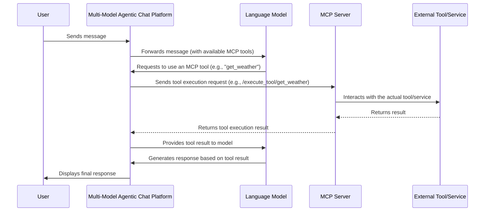

# MCP Server Integration Overview

This document provides an overview of the Model Context Protocol (MCP) Server integration within our Multi-Model Agentic Chat platform.

## What is MCP (Model Context Protocol)?

MCP (Model Context Protocol) is a standardized way for language models and other AI agents to access and interact with external tools, data sources, and services. It defines a common interface that allows the chat platform to dynamically provide context and capabilities to the underlying models. This enables models to perform actions, retrieve information, and offer richer, more interactive experiences.

Key aspects of MCP include:
- **Standardized Communication:** Defines a consistent way for the platform to list available tools and for models to request their use.
- **Dynamic Tool Discovery:** Allows the platform to expose different sets of tools based on user permissions, current context, or specific tasks.
- **Contextual Information:** Facilitates the injection of relevant data and context into the model's prompt, enabling more informed and accurate responses.

## Benefits of Using MCP in Our Platform

Integrating MCP servers into our platform offers several significant advantages:

- **Enhanced Model Capabilities:** Empowers models to go beyond text generation by interacting with external systems, such as databases, APIs, or custom business logic.
- **Increased Interactivity:** Allows for the creation of more dynamic and responsive chat experiences where models can perform actions on behalf of the user.
- **Improved Accuracy and Relevance:** By providing models with access to real-time data and specific tools, MCP helps ensure that responses are more accurate, up-to-date, and relevant to the user's query.
- **Extensibility and Customization:** Enables developers to easily add new tools and capabilities to the platform by implementing MCP-compliant servers. This promotes a modular and scalable architecture.
- **Simplified Integration:** Provides a standardized protocol, reducing the complexity of integrating diverse external services.

## Architecture Overview

The MCP integration follows a client-server architecture:

1.  **Multi-Model Agentic Chat Platform (Client):**
    *   Manages user interactions and chat sessions.
    *   Discovers available MCP servers and their capabilities.
    *   When a model needs to use an external tool, the platform acts as an intermediary.
    *   It formats requests according to the MCP specification and sends them to the appropriate MCP server.
    *   Receives responses from MCP servers and relays the results back to the model and/or user.

2.  **MCP Servers (Servers):**
    *   Independent services that expose specific tools or data sources via MCP-defined endpoints.
    *   Each server advertises its capabilities (e.g., available tools, expected inputs, output formats).
    *   Receives requests from the chat platform, executes the requested action (e.g., API call, database query), and returns the result.
    *   Can be developed and deployed independently, allowing for a microservices-like approach to extending platform functionality.

**Flow:**

This architecture allows for a decoupled system where the core chat platform can leverage a growing ecosystem of specialized MCP servers.