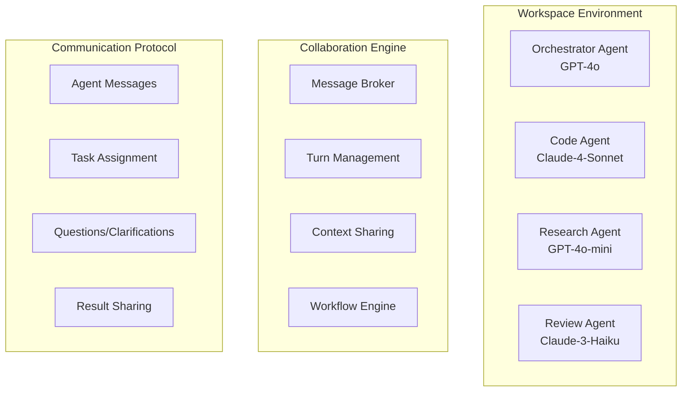

# Product Context

This file provides a high-level overview of the project and the expected product that will be created. Initially it is based upon AI_Inference_Platform_Technical_Specification_v2.md and all other available project-related information in the working directory. This file is intended to be updated as the project evolves, and should be used to inform all other modes of the project's goals and context.

## Project Goal

**"An infinitely extensible AI inference platform where agents collaborate seamlessly"**

Building a comprehensive, modular AI inference platform with **multi-agent collaboration capabilities** and infinite extensibility. The platform enables different AI models to work together in the same workspace, communicating and collaborating on complex tasks while maintaining a clean, modular architecture.

## Key Features

### Core Foundation

* Solid ChatGPT-like web interface foundation
* **Multi-agent workspace collaboration** - agents can communicate with each other
* Modular architecture with standardized templates
* Code reuse and migration from existing prototype
* Easy provider/model management and filtering
* Advanced agent creation and management
* Workspace and knowledge persistence

### Multi-Agent Collaboration Capabilities

* **Agent-to-Agent Messaging**: Direct communication protocol between agents
* **Role-Based Orchestration**: Define agent roles (orchestrator, specialist, reviewer, etc.)
* **Turn Management**: Intelligent turn-taking and conversation flow
* **Context Sharing**: Shared workspace context and memory
* **Task Delegation**: Agents can assign tasks to other agents
* **Collaborative Workflows**: Pre-defined multi-agent workflows

### Technical Performance Targets

* Agent-to-agent message latency < 100ms
* Workspace load time < 2 seconds
* Support for 10+ simultaneous agents per workspace
* 99.9% message delivery reliability

### User Experience Goals

* Intuitive multi-agent workspace creation
* Seamless agent collaboration flows
* Clear visibility into agent activities and status
* Easy workspace sharing and templates

## Overall Architecture

### High-Level Components

### Core Modules

#### 1. Multi-Agent Collaboration Module

**Purpose**: Enable seamless communication and collaboration between multiple agents in a workspace

#### 2. Enhanced AI Provider Management Module

**Modifications**: Extend current provider system with agent-specific configurations, load balancing for multi-agent scenarios, provider failover for agent continuity

#### 3. Agent Management Module (Major Enhancement)

**Building on Existing**: Expand current basic agent CRUD to full collaboration system with role definitions, agent discovery, performance analytics

#### 4. Workspace Collaboration Module (New)

**Purpose**: Manage multi-agent workspaces and orchestrate collaboration with templates, real-time monitoring, workflow designer, conflict resolution

#### 5. Communication Protocol Module (New)

**Purpose**: Handle all agent-to-agent communication with message routing, priority queuing, persistence, analytics

### Technical Stack

#### Backend (Building on Existing)

* **Runtime**: Node.js 18+ (current)
* **Framework**: Express.js (current) + WebSocket for real-time agent communication
* **Database**: SQLite (current) with enhanced schema for collaboration
* **Message Queue**: Add Redis for agent message broking
* **Real-time**: Socket.io for live agent status and messaging

#### Frontend (Enhancing Existing)

* **Base**: Current vanilla JS structure, enhanced for multi-agent
* **Real-time Updates**: WebSocket integration for live agent communication
* **Agent UI**: Enhanced current agent manager for collaboration features
* **Workspace Views**: New multi-agent workspace interface

### Database Schema Extensions

Key new tables for collaboration:

* `agent_conversations` - Agent conversations within workspaces
* `agent_messages` - Individual messages between agents
* `agent_tasks` - Task assignments between agents
* `workspace_context` - Shared workspace context

### Example Collaboration Workflows

#### Code Development Workflow

1. User asks: "Build a REST API for user management"
2. **Orchestrator (GPT-4o)**: Analyzes request, creates development plan
3. **Orchestrator → Code Agent (Claude-4-Sonnet)**: "Create user model and CRUD endpoints"
4. **Code Agent**: Implements code, asks clarification about authentication
5. **Orchestrator**: Provides authentication requirements
6. **Code Agent → Review Agent**: "Please review this user management API"
7. **Review Agent**: Reviews code, suggests improvements
8. **Code Agent**: Implements suggestions, delivers final result

#### Research & Analysis Workflow

1. User: "Analyze market trends for AI startups in 2024"
2. **Orchestrator**: Breaks down into research tasks
3. **Research Agent 1**: Gathers funding data
4. **Research Agent 2**: Collects market size data
5. **Analysis Agent**: Combines data and creates insights
6. **Writing Agent**: Creates final comprehensive report

---
*2025-05-29 23:51:34 - Initial Memory Bank creation with comprehensive project context from AI_Inference_Platform_Technical_Specification_v2.md*
